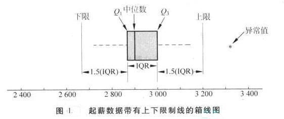

# 工业蒸汽量预测

#### 数据说明

V0-V37共38个字段是特征变量，target字段是目标变量。

测试集没有target字段。

#### 评估指标

均方误差$MSE(Mean Squared Error)$
$$
MSE=\frac{SSE}{n}=\frac{1}{n}\sum_{i=1}^{n}(y-\hat{y})^2
$$

#### 模型

1. 线性回归(Linear Regression)
2. 岭回归(Ridge Regression) (L2正则)
3. LASSO(Least Absolute Shrinkage and Selection Opterator)回归 (L1正则)
4. 决策树回归(Decision Tree Regressor)
5. 梯度提升树回归(Gradient Boosting Decision Tree Regressor)

## 数据探索

#### 变量分析

##### 单变量分析

- Histogram

- Box Plot

##### 双变量分析

1. 连续型与连续型
   - 散点图
   - 相关性
2. 类别型与类别型
   - 双向表
   - 堆叠柱状图
   - 卡方检验：主要用于两个和两个以上样本率及两个二值型离散变量的关联性分析，即比较理论频次和实际频次的吻合程度或拟合优度。
3. 类别型与连续型
   - 小提琴图，分析不同类别时，另一个连续变量的分布情况。

#### 缺失值处理

1. 删除。成列删除，成对删除
2. 平均数、众数、中值填充
3. 预测模型填充

#### 异常值处理

##### 异常值的检测

- 箱线图、直方图、散点图
- 箱线图四分位数：
  - 利用数据中的五个统计量：最小值、第一四分位数、中位数、第三四分位数与最大值来描述数据的一种方法，它也可以粗略地看出数据是否具有有对称性，分布的分散程度等信息。
  - 
  - $IQR = Q_3 - Q_1$，箱线图的上、下限制线分别在比$Q_1$低1.5(IQR)和比$Q_3高1.5(IQR)的位置上

##### 异常值的处理

- 删除、转换、填充、区别对待

数据取对数会减轻由极值引起的变化

#### 可视化数据分布

- 箱形图
- 直方图和QQ图
- KDE分布图：核密度估计，可以理解为对直方图的加窗平滑。通过绘制KDE图可以查看并对比训练集和测试集中特征变量的分布情况，发现两个数据集中分布不一致的特征变量。**删除训练集和测试集中分布不一致的特征，否则会导致模型泛化能力变差**
- 线性回归关系图：查看变量与target之间的线性回归关系

#### 查看特征变量的相关性

1. 计算相关系数

2. 相关热力图

3. 根据相关系数筛选特征变量
4. Box-Cox变换：可以使线性模型在满足线性、正态性、独立性及方差齐性的同时，又不丢失信息。

## 3. 特征工程

### 3.1. 特征工程的重要性

1. 特征越好，灵活性越强
2. 特征越好，构建的模型月简单
3. 特征越好，模型的性能月出色

### 3.2. 数据预处理和特征处理

#### 3.2.1 数据预处理

1. ##### 数据采集

2. ##### 数据清洗

3. ##### 数据采样

#### 3.2.2 特征处理

1. 标准化
2. 区间缩放法
3. 归一化
4. 定量特征二值化(threshold阈值)
5. 定性特征哑编码(OneHot)
6. 缺失值处理
7. 数据转换
   - 多项式转换
   - 指数、对数变换

### 3.3 特征降维

#### 3.3.1 特征选择

- 特征选择的方法
  1. 过滤法 Filter 按照发散性和相关性对特征进行评分，设定阈值选择特征。
     - 方差选择法
     - 相关系数、卡方检验或最大信息系数作为得分计算的方法
  2. 包装法 Wrapper 根据目标函数（通常是预测效果评分）每次选择若干特征，或者排除若干特征。
  3. 嵌入法 Embedded 使用机器学习的某些算法和模型进行训练，得到每个特在的权值系数，根据系数从大到小选择特征。

#### 3.3.2 线性降维

1. 主成分分析
2. 线性判别分析

### 3.4 赛题特征工程

#### 3.4.1 异常值分析

#### 3.4.2 最大最小的归一化

#### 3.4.3 KDE查看数据分布

#### 3.4.4 特征相关性

#### 3.4.5 特征降维

#### 3.4.6 多重共线性分析

- 多重共线性分析的原则是特征组之间的相关性系数较大，即每个特征变量与其他特征变量之间的相关性系数较大，故可能存在较大的共线性影响，这会导致模型估计不准。因此，后续要使用PCA对数据进行处理，去除多重共线性。

#### 3.4.7 PCA处理

- 利用PCA的方法去除数据的多重共线性，并进行降维。PCA处理后可保持90%的信息数据。

## 4. 模型训练

### 4.1 回归及相关技术

#### 4.1.3 线性回归模型

- 一元线性回归
- 多元线性回归

#### 4.1.4 K近邻回归模型

- 欧式距离

#### 4.1.5 决策树回归模型

| 变量标签 | 1    | 2    | 3    | 4    | 5    | 6     | 7     | 8     | 9     |
| -------- | ---- | ---- | ---- | ---- | ---- | ----- | ----- | ----- | ----- |
| x        | 2.92 | 3.7  | 4.94 | 5.01 | 5.36 | 6.88  | 8.34  | 9.2   | 9.71  |
| y        | 2.73 | 5.83 | 5.89 | 8.0  | 9.9  | 12.89 | 12.97 | 14.39 | 18.53 |

1. 选择最优分裂点，记为第k大的数

损失函数为：
$$
L(D)=\sum_{i=1}^{k}{(y_i - \bar{y}_1)^2} + \sum_{i=k+1}^{8}{(y_i - \bar{y}_2)^2}
$$

$$
\bar{y}_1 = \frac{1}{k}\sum_{i=1}^{k}{y_i}, \bar{y}_2 = \frac{1}{8-k}\sum_{i=k+1}^{8}{y_i}
$$

2. 计算根据分割点D划分的子区域损失值。

#### 4.1.6 集成学习回归模型

1. ##### 随机森林回归模型

   主要优点：

   1. 在当前算法中，具有极好的准确率；
   2. 能够有效地运行在大数据集上；
   3. 能够处理具有高维特征的输入样本，而且不需要降维；
   4. 能够评估各个特征在分类问题上的重要性；
   5. 在生成过程中，能够获取到内部生成误差的一种无偏估计；
   6. 对于缺省值问题也能获得很好的效果。

2. ##### LightGBM回归模型

   LightGBM是微软开发的一个GBDT算法框架，支持高效率的并行训练，具有更快的训练速度、更低的内存消耗、更好的准确率、分布式支持、可以快速处理海量数据等特征。

## 5 模型验证

### 5.1 模型评估的概念和方法

#### 5.1.1 过拟合和欠拟合

#### 5.1.2 模型的泛化与正则化

- 岭回归（L2）和LASSO回归（L1） 不同之处：
  1. 使用岭回归改进的多项式回归算法，随着𝛂的改变，拟合曲线始终是曲线，直到最后变成一条几乎水平的直线；也就是说，在使用岭回归之后多项式回归算法在模型变量前还是有系数的，因此很难得到一条斜的直线。
  2. 而使用LASSO回归改进的多项式回归算法，随着𝛂的改变，拟合曲线会很快变成一条斜的曲线，最后慢慢变成一条几乎水平的直线，即模型更倾向于一条直线。

#### 5.1.3 回归模型的评估指标和调用方法

1. 平均绝对误差
   $$
   MAE = \frac{1}{n}\sum_{i=1}^{n}{|f_i-y_i|}=\frac{1}{n}\sum_{i=1}^{n}{|e_i|}
   $$

2. 均方误差:  $y_i$实际值， $\hat{y}_i$ 预测值
   $$
   MSE = \frac{1}{n}\sum_{i=1}^{n}{(y_i-\hat{y}_i)^2}
   $$

3. 均方根误差

$$
RMSE = \sqrt{MSE} = \sqrt{SSE/N} = \frac{1}{n}\sqrt{\sum_{i=1}^{n}{w_i(y_i-\hat{y}_i)^2}}
$$

4. R平方值
   $$
   R^2(y,\hat y) = 1 - \frac{\sum_{i=0}^{n_{samples}-1}{(y_i - \hat{y}_i)^2}}{\sum_{i=0}^{n_{samples}-1}{(y_i - \bar{y}_i)^2}}
   $$

#### 5.1.4 交叉验证

1. 简单交叉验证
2. K折交叉验证
3. 留一法交叉验证
4. 留P法交叉验证

## 6 特征优化

### 6.1 特征优化的方法

#### 6.1.1 合成特征

- 合成特征是指不在输入特征之列，而是从一个或多个输入特征衍生而来的特征。通过标准化或缩放单独创建的特征不属于合成特征。

- 合成特征包括以下类型：
  1. 将一个特征与其本身或其他特征相乘（称为特征组合）
  2. 两个特征相除
  3. 对连续特征进行分桶（分箱），以分为多个区间分箱

#### 6.1.2 特征的简单变换

- 数值特征的变换和组合

  1. 多项式特征(polynomial feature)

  2. 比例特征(ratio feature): X1/X2
  3. 绝对值(absolute value)
  4. max(X1, X2), min(X1, X2), X1 or X2

- 类别特征与数值特征的组合

  - 中位数，算数平均数， 众数，最小值，最大值，标准差，方差，频数

#### 6.1.3 用决策树创造新特征

#### 6.1.4 特征组合

1. 对非线性规律进行编码 例如将两个特征的值相乘形成的特征组合
2. 组合独热矢量 One-Hot
3. 使用分桶特征列训练模型 分桶特征：是以一定方式将连续型数值特征划分到不同的桶中，可以理解为是对连续型特征的一种离散化处理方式。

## 7 模型融合

### 7.1 模型优化

#### 7.1.1 模型学习曲线

#### 7.1.2 模型融合提升技术

1. Bagging方法和随机森林
   - 自助采样法
   - 随机森林相比Bagging：基本学习器限定为决策树；随机属性选择。
2. Boosting方法
   - Adaboost
   - 提升树
   - 梯度提升树

#### 7.1.3 预测结果融合策略

1. Voting
2. Averaging and **Ranking**
3. **Blending**
4. **Stacking**

